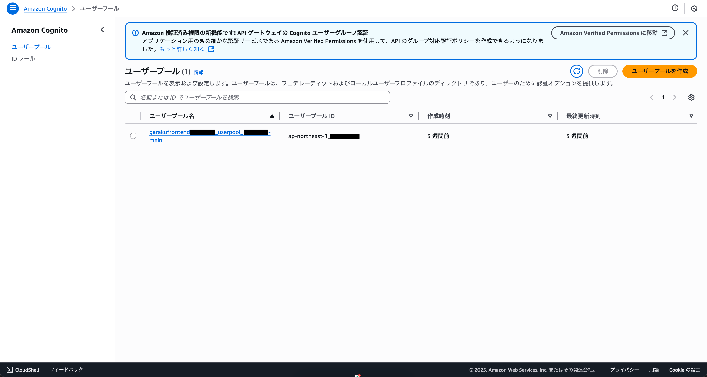
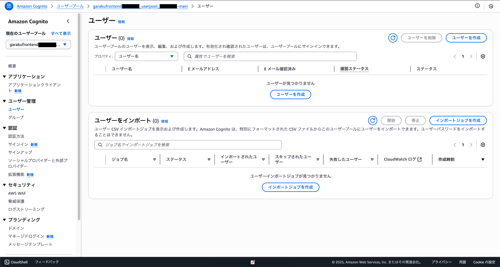
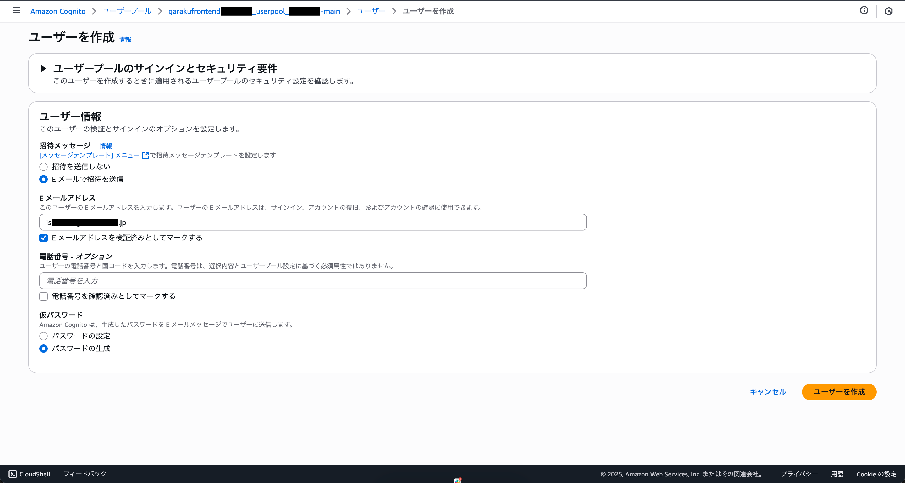
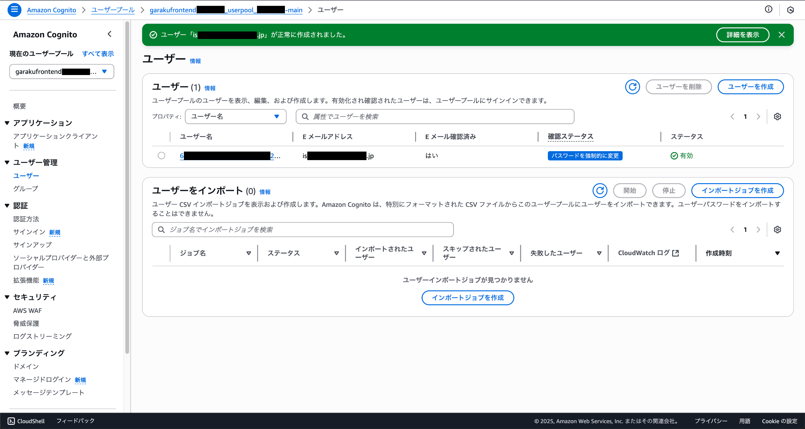
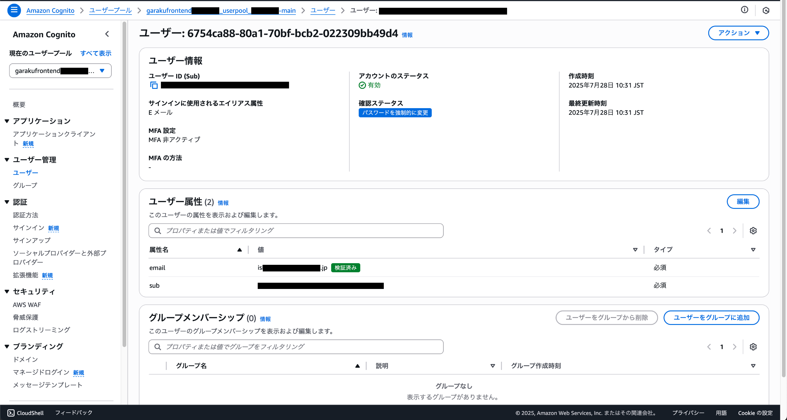
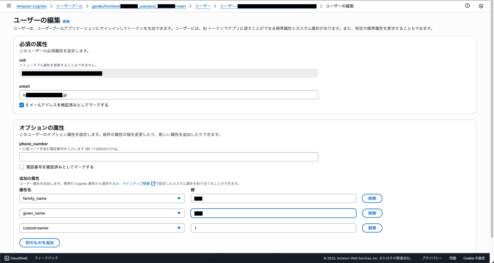

# オーナーアカウントの追加

クラウド勤怠を使用するには、管理者からの招待が必要です。しかし、初めて利用する場合は、管理者ユーザーが存在しないため、最初の管理者ユーザーとしてオーナーアカウントを追加する必要があります。この手順では、オーナーアカウントを追加する方法を説明します。

:::warning[注意]
オーナーアカウントを追加する時以外は、基本的にCognitoからユーザーを追加することはありません。オーナーアカウント以外は、クラウド勤怠の管理者画面から操作してください。
:::

## AWSコンソールにログイン

AWSコンソールにログインし、Cognitoサービスにアクセスします。Cognitoは、ユーザー認証と管理を行うためのAWSのサービスです。

## ユーザープールの選択

Cognitoのダッシュボードから、クラウド勤怠で使用しているユーザープールを選択します。通常、ユーザープールの名前は「garakufrontend〜」など、プロジェクトに関連する名前になっています。

## ユーザーの追加

左側のメニューから「ユーザー管理」を選択し、「ユーザー」をクリックします。ユーザーの一覧が表示されます。ここで「ユーザーを作成」ボタンをクリックします。

## ユーザー情報の入力

### 招待メッセージ

Eメールで招待を送信

### Eメールアドレス

オーナーアカウントとして使用するメールアドレスを入力します。このメールアドレスは、クラウド勤怠の管理者画面にログインするために使用されます。

また、「Eメールアドレスを検証済みとしてマークする」にチェックを入れてください。これにより、ユーザーがメールアドレスを検証する手間が省けます。

### 仮パスワード

仮パスワードを入力します。このパスワードは、ユーザーが初めてログインする際に使用されます。ユーザーはログイン後、パスワードを変更することができます。

任意の値で設定することもできますが、「パスワードの生成」を選択すると、ランダムなパスワードが生成されて、指定したメールアドレスに送信されます。

### 作成の確認

すべての情報を入力したら、「ユーザーを作成」ボタンをクリックします。これにより、オーナーアカウントが作成され、指定したメールアドレスに招待メールが送信されます。

## 属性の追加

オーナーアカウントを作成した後に、クラウド勤怠で使用している属性を追加する必要があります。先ほど作成した、オーナーアカウントのユーザーを選択して、詳細ページに移動します。

移動が完了したら、ユーザー属性のセクションに移動し、右上の「編集」ボタンをクリックします。

### 属性の入力

以下の属性を入力します。これらの属性は、クラウド勤怠でオーナーアカウントを正しく機能させるために必要です。

| 属性名 | 属性値 |
| --- | --- |
| family_name | オーナーの苗字(例：`田中`) |
| given_name | オーナーの名前(例：`太郎`) |
| custom:owner | `1:(有効)` |    

