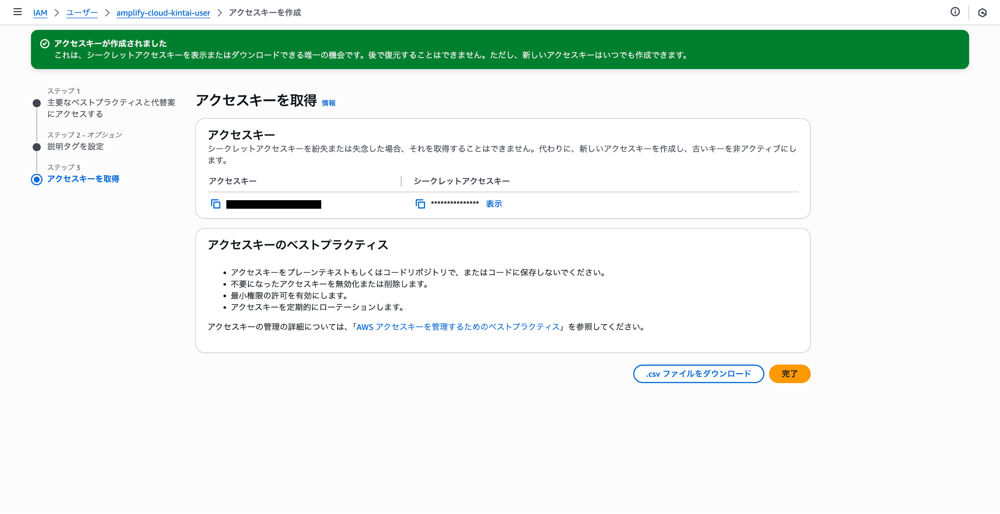

# Amplify CLIの設定

次のコマンドを実行してAmplify CLIの設定を行います。これにより、AWSアカウントと連携し、必要なリソースを作成することができます。

```bash
amplify configure
```

このコマンドを実行すると、ブラウザが開き、AWSの管理コンソールにリダイレクトされます。以下の手順に従って設定を進めてください。

:::danger[ログイン中のAWSアカウントに注意]
Amplify CLIを使用する際は、現在ログインしているAWSアカウントに注意してください。誤って他のアカウントで操作を行うと、意図しないリソースが作成される可能性があります。必ず正しいアカウントでログインしていることを確認してください。
:::

ログインしているアカウントが正しいことを確認したら、ローカルのターミナルに戻り、`Press Enter to continue`の指示に従ってEnterキーを押します。

## リージョンの選択

どこのリージョンでリソースを作成するかを選択します。このクラウド勤怠は日本での利用を想定しているため、`ap-northeast-1`（東京リージョン）を選択することをお勧めします。

## ユーザーの作成

リージョンを選択すると、ブラウザでAWSの管理コンソールが開きます。ここで新しいIAMユーザーを作成します。ユーザー名は任意ですが、`amplify-cloud-kintai-user`を既定値としています。


:::tip[IAMユーザー名の変更]
もし、変更する場合は、以下のコードの値と一致するようにしてください。

```ts title="amplify/backend/custom/customResource1b080f88/cdk-stack.ts"
const keyAdmin = iam.User.fromUserName(
    this,
    "keyAdmin",
    // highlight-start
    "amplify-cloud-kintai-user"
    // highlight-end
);
```
:::

### ポリシーの設定

次に、ユーザーに必要なポリシーを設定します。`AdministratorAccess`ポリシーを選択して、ユーザーに管理者権限を付与します。これにより、Amplify CLIが必要なリソースを作成できるようになります。


### ユーザーの作成完了

先ほど作成したユーザーが一覧に表示されていることが確認できたら、ユーザーの作成は完了です。


## アクセスキーの取得

作成したユーザーを使用して、CLIからAWSにアクセスするためのアクセスキーを取得します。

先ほど作成したユーザーの詳細ページに移動し、`セキュリティ認証情報`タブをクリックします。


次に、`アクセスキーの作成`ボタンをクリックして、新しいアクセスキーを生成します。


ユースケースを選択する画面が表示された場合は、`コマンドラインインターフェイス (CLI)`を選択します。

もし、レコメンデーションが表示された場合は、`上記のレコメンデーションを理解し、アクセスキーを作成します。`をチェックし、`次へ`ボタンをクリックします。


説明とタグの入力画面が表示されますが、特に入力する必要はありません。そのまま`アクセスキーを作成`ボタンをクリックします。


アクセスキーが生成されると、以下のような画面が表示されます。



:::warning[重要]
この画面で表示されている`アクセスキーID`と`シークレットアクセスキー`をローカルのターミナルで入力します。これらの情報は、画面を閉じると再度表示されないため、必ずコピーして保存してください。ファイルダウンロード機能を使用して、`CSV形式でダウンロード`することもできます。
:::

## アクセスキーの入力

アクセスキーを取得したら、ローカルのターミナルに戻り、以下のコマンドを実行してAmplify CLIを設定します。

アクセスキー、シークレットアクセスキー、プロファイル名を入力するように求められます。

```bash
Enter the access key of the newly created user:
? accessKeyId:  ********************
? secretAccessKey:  ****************************************
This would update/create the AWS Profile in your local machine
? Profile Name:  <profile-name>
```

::danger[プロファイル名の注意]
プロファイル名は、省略すると`default`が設定されますが、プロファイル名を指定した方が誤操作を防げます。プロファイル名は、後でAmplify CLIを使用する際に指定する必要があります。
:::
