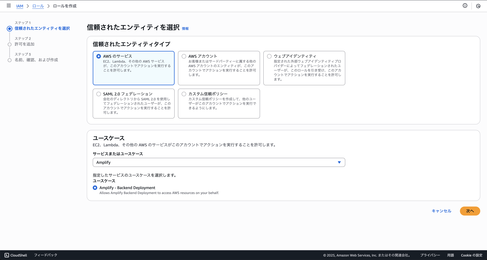
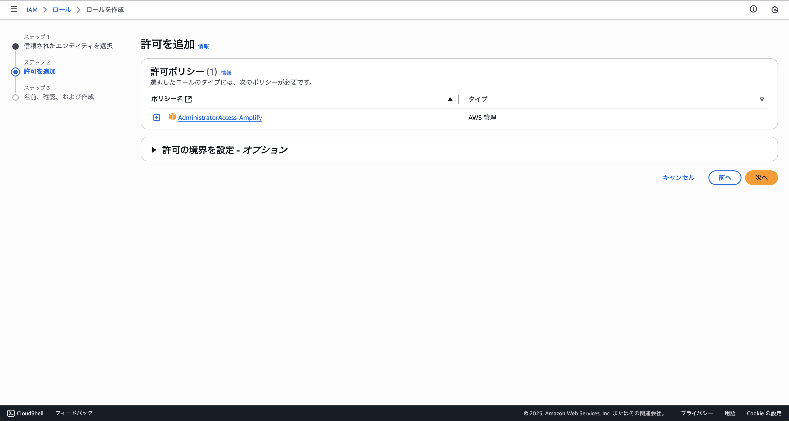
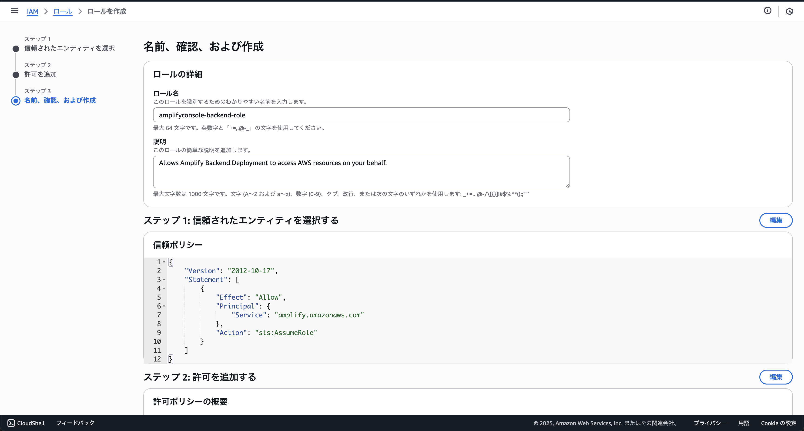
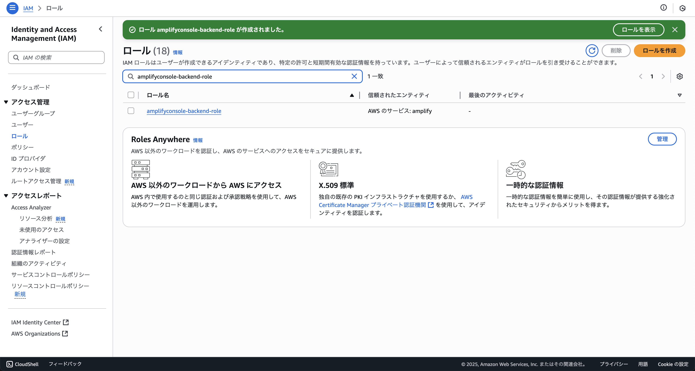

# ロールの作成

クラウド勤怠アプリを実行するために必要なIAMロールを作成します。このロールは、Amplify CLIがAWSリソースにアクセスするために使用されます。

## AWSコンソールにログイン

まず、AWSコンソールにログインします。以下のリンクをクリックして、東京リージョンのIAMロール作成画面にアクセスしてください。

[東京リージョンのIAMロール作成画面](https://us-east-1.console.aws.amazon.com/iam/home?region=ap-northeast-1#/roles/create)


## 信頼されたエンティティの選択

`AWSののサービス`を選択し、`Amplify`を選択し、次へ進みます。



## 許可を追加

既定で選択されているポリシーが画像と同じであることを確認し、次へ進みます。



## ロール名の設定

ロール名は、`amplifyconsole-backend-role`と入力し、ロールを作成をクリックします。



:::tip[ロール名の変更]
もし、ロール名を変更する場合は、以下のコードの値と一致するようにしてください。

```ts title="amplify/backend/custom/customResource1b080f88/cdk-stack.ts"
const roleName = "amplifyconsole-backend-role";
```
:::

## ロールの作成完了

ロールの作成が完了したら、以下のような画面が表示されます。



:::tip[検索機能の利用]
ロールの一覧が長い場合は、検索機能を利用して`amplifyconsole-backend-role`を検索してください。これにより、作成したロールを簡単に見つけることができます。
:::
