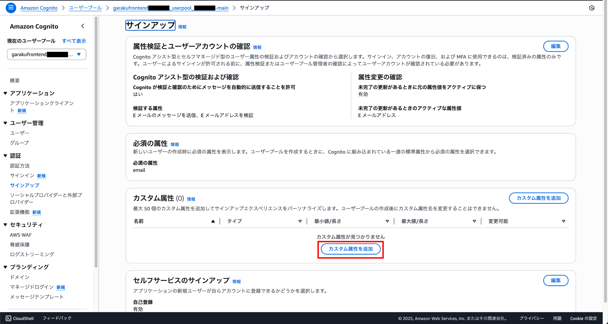
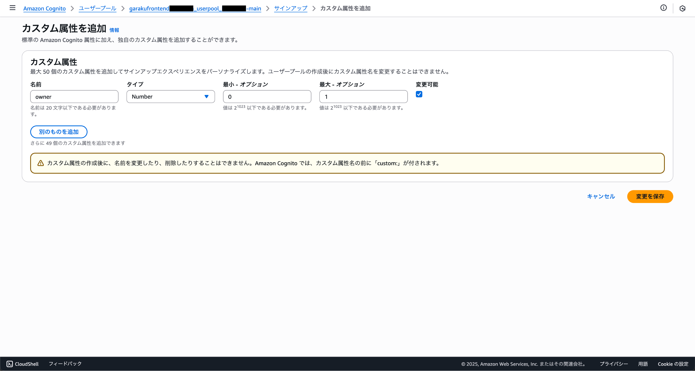
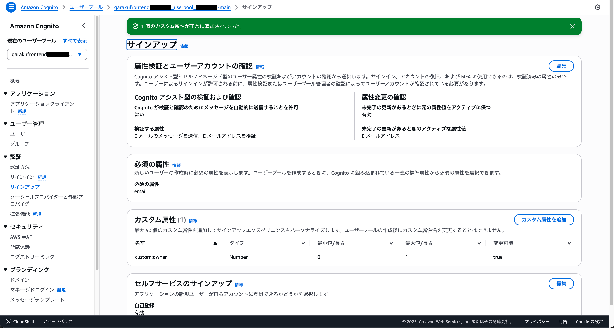

# カスタム属性の追加

クラウド勤怠では、Cognitoのカスタム属性を使用して、オーナーアカウントの情報を管理しています。この手順では、Cognitoにカスタム属性を追加する方法を説明します。

## AWSコンソールにログイン

AWSコンソールにログインし、Cognitoサービスにアクセスします。Cognitoは、ユーザー認証と管理を行うためのAWSのサービスです。

## ユーザープールの選択

Cognitoのダッシュボードから、クラウド勤怠で使用しているユーザープールを選択します。通常、ユーザープールの名前は「garakufrontend〜」など、プロジェクトに関連する名前になっています。

## オーナー属性(カスタム)の追加

左側のメニューから「サインアップ」を選択し、「カスタム属性を追加」をクリックします。ここで、オーナーアカウントに必要なカスタム属性を追加します。

### 属性の設定

以下の情報を入力して、カスタム属性を追加します。

| 属性名 | 属性値 |
| --- | --- |
| 名前 | `owner` |
| タイプ | `Number` |
| 最小値 | `0` |
| 最大値 | `1` |
| 変更可能 | `true` |

## 属性の確認

一覧に追加したカスタム属性が表示されます。ここで、属性が正しく追加されていることを確認します。

