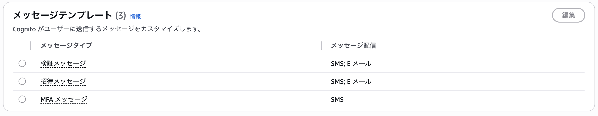
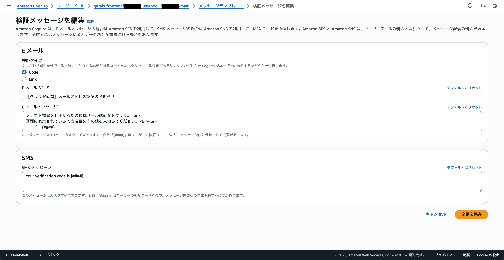
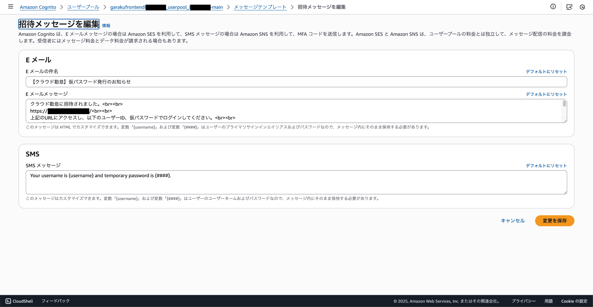

# メッセージテンプレートを追加

クラウド勤怠では、Cognitoのメッセージテンプレートを使用して、ユーザー登録やメールアドレス認証の際に送信されるメールの内容をカスタマイズしています。この手順では、Cognitoにメッセージテンプレートを追加する方法を説明します。

## AWSコンソールにログイン

AWSコンソールにログインし、Cognitoサービスにアクセスします。Cognitoは、ユーザー認証と管理を行うためのAWSのサービスです。

## ユーザープールの選択

Cognitoのダッシュボードから、クラウド勤怠で使用しているユーザープールを選択します。通常、ユーザープールの名前は「garakufrontend〜」など、プロジェクトに関連する名前になっています。

## メッセージテンプレートの追加

左側のメニューから「メッセージテンプレート」を選択し、一覧画面を表示します。



### 検証メッセージ

一覧から「検証メッセージ」を選択し、「編集」をクリックします。



#### タイトル

```
【クラウド勤怠】メールアドレス認証のお知らせ
```

#### 本文

```
クラウド勤怠を利用するためにはメール認証が必要です。<br>
画面に表示されている入力項目に次の値を入力してください。<br><br>
コード：{####}
```

### 招待メッセージ

一覧から「招待メッセージ」を選択し、「編集」をクリックします。



#### タイトル

```
【クラウド勤怠】仮パスワード発行のお知らせ
```

#### 本文

```
クラウド勤怠に招待されました。

https://example.com/

上記のURLにアクセスし、以下のユーザーID、仮パスワードでログインしてください。

ユーザー名：{username}
仮パスワード：{####}

仮パスワードでログイン後、ご自身で使用するパスワードへ変更が必要です。
また、登録したパスワードは絶対に他人へ教えないでください。
```

`https://example.com/`の部分は、所属企業・団体ごとに異なるため、実際のURLを確認して変更してください。
