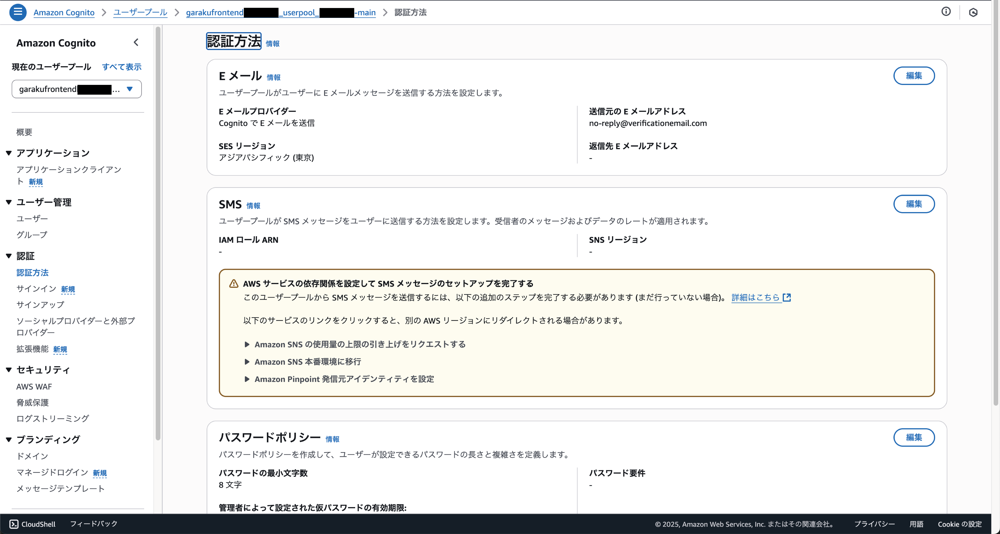
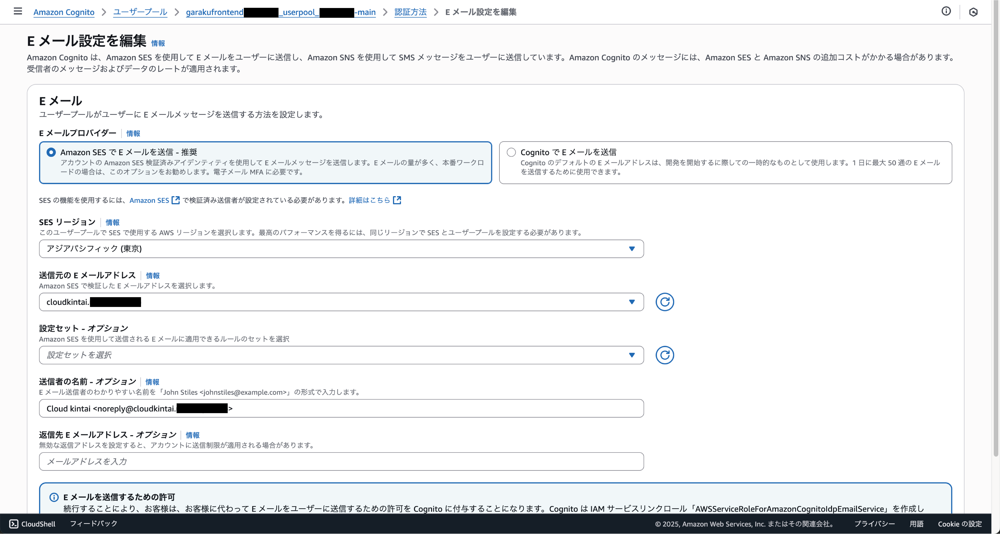

# 送信元メールアドレスの変更

クラウド勤怠では、Cognitoの設定を変更して、送信元のメールアドレスの変更が必要です。メールアドレスを変更しない場合は、AWSが表示で設定したメールアドレスが送信元として使用されます。そのままでも動作しますが、メールの信頼性やセキュリティ面で問題が発生する可能性がありますので、変更をお勧めします。

## AWSコンソールにログイン

AWSコンソールにログインし、Cognitoサービスにアクセスします。Cognitoは、ユーザー認証と管理を行うためのAWSのサービスです。

Cognitoのダッシュボードから、クラウド勤怠で使用しているユーザープールを選択します。通常、ユーザープールの名前は「garakufrontend〜」など、プロジェクトに関連する名前になっています。

## メールアドレスの変更

左側のメニューから「認証方法」を選択し、「Eメール」セクションの編集をクリックします。

## 送信元メールアドレスの設定

「送信元メールアドレス」に、クラウド勤怠で使用するメールアドレスを入力します。

| 項目 | 説明 |
| --- | --- |
| Eメールプロバイダー | `Amazon SESでEメールを送信`を選択 |
| 送信元メールアドレス | クラウド勤怠で使用するメールアドレスを入力 |
| 送信者の名前 | `Cloud Kintai <noreply@xxxxx>`の形式で入力 |

:::warning[送信元メールアドレス]
事前に、AWSのSESで送信元メールアドレスを検証しておく必要があります。SESの設定が完了していない場合は、メールが送信されませんので注意してください。
:::
