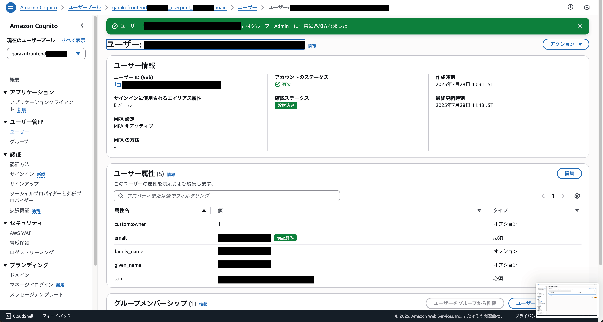

# ユーザグループの新規作成

クラウド勤怠では、Cognitoのユーザグループを使用して、権限の管理を行っています。この手順では、Cognitoにユーザグループを追加する方法を説明します。

## AWSコンソールにログイン

AWSコンソールにログインし、Cognitoサービスにアクセスします。Cognitoは、ユーザー認証と管理を行うためのAWSのサービスです。

Cognitoのダッシュボードから、クラウド勤怠で使用しているユーザープールを選択します。通常、ユーザープールの名前は「garakufrontend〜」など、プロジェクトに関連する名前になっています。

## グループの作成

左側のメニューからユーザー管理の「グループ」を選択し、「グループを作成」をクリックします。

### スタッフ(Staff)グループの作成

ユーザーグループ名に`Staff`と入力して、「グループを作成」をクリックします。

### スタッフ管理者(Admin)グループの作成

次に、ユーザーグループ名に`Admin`と入力して、「グループを作成」をクリックします。

## グループの確認

一覧に追加したグループが表示されます。ここで、グループが正しく追加されていることを確認します。

## ユーザーにグループを割り当てる

ユーザーをグループに割り当てるには、左側のメニューから「ユーザー」を選択し、対象のユーザーをクリックします。

次に、ユーザーの詳細画面で「グループ」タブを選択し、「グループに追加」をクリックします。

