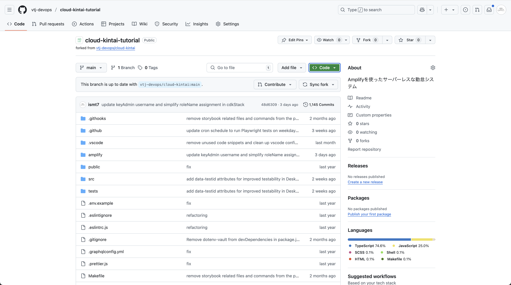
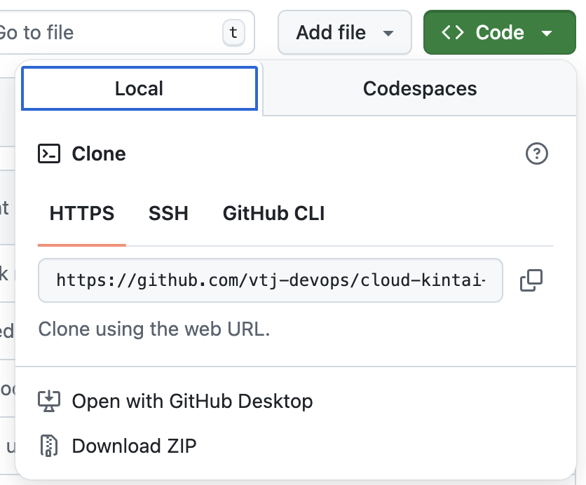

# GitHubリポジトリのクローン

前のセクションでフォークしたリポジトリをローカルにクローンします。初めて環境を構築する際はローカルからAmplify CLIを使用して環境構築を行います。

## リポジトリのURLを取得

GitHubのリポジトリページにアクセスし、画面右上の「Code」ボタンをクリックします。



表示されたメニューから「HTTPS」または「SSH」のいずれかを選択し、リポジトリのURLをコピーします。SSHを使用する場合は、事前にSSHキーの設定が必要です。



## リポジトリをローカルにクローン

次に、ターミナルを開き、以下のコマンドを実行してリポジトリをクローンします。

```bash
git clone <repository-url>
cd <repository-name>
```

`<repository-url>`は、コピーしたリポジトリのURLに置き換えてください。

`<repository-name>`は、クローンしたリポジトリのディレクトリ名です。通常、リポジトリ名と同じになります。

クローンが完了すると、ローカルにリポジトリのコピーが作成されます。GitHubのリポジトリページで確認した内容と同じファイル構成がローカルに反映されているはずです。
