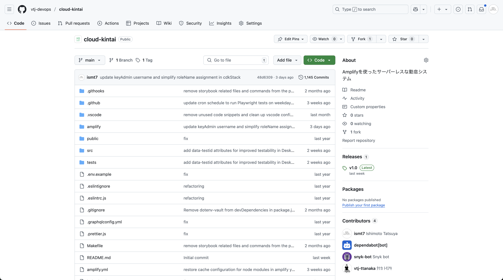
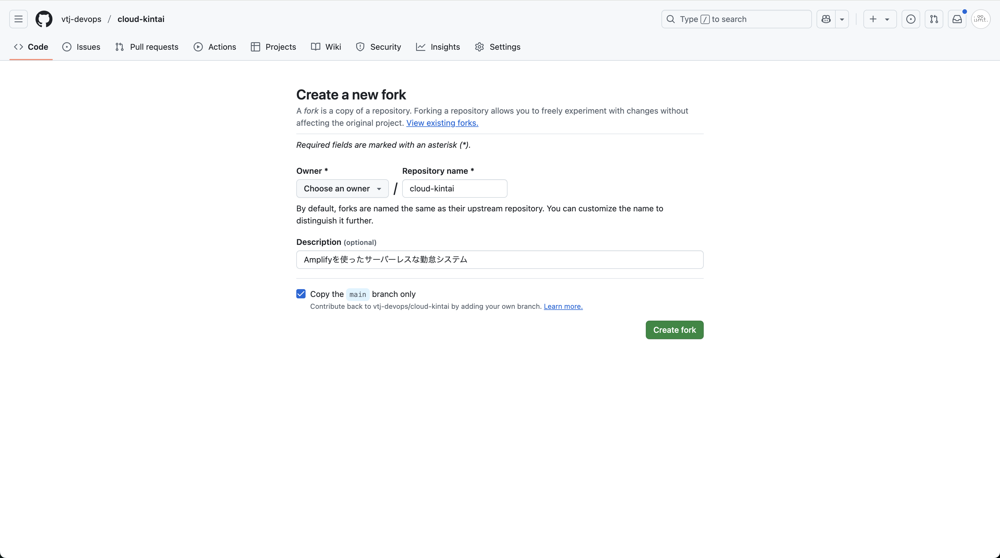
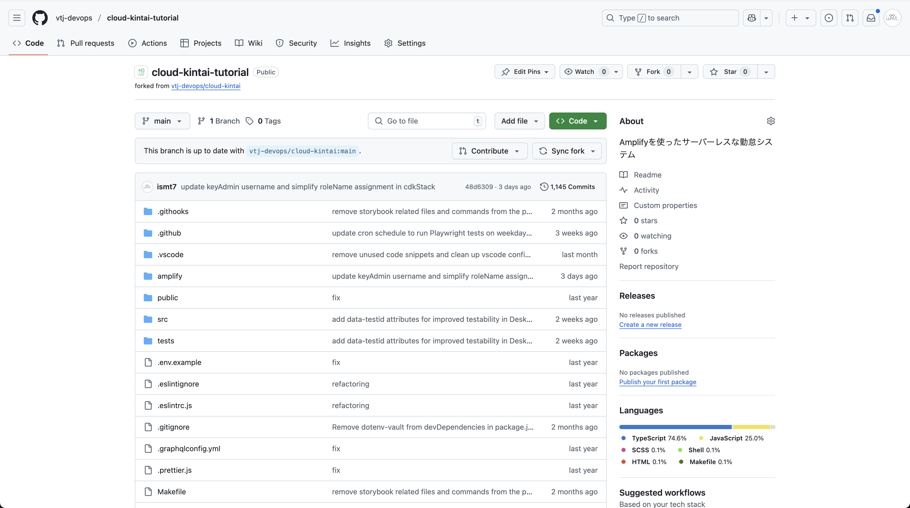

# GitHubリポジトリの準備

AWS Amplifyを使用して継続的デプロイを行うために、GitHubリポジトリをフォークしてください。最終的には、Amplify CLIで環境構築を行った際に生成された設定情報をGitHubリポジトリ上で管理する必要があります。

## クラウド勤怠のリポジトリをフォーク

[ここから](https://github.com/vtj-devops/cloud-kintai)クラウド勤怠のリポジトリへアクセスできます。

画面右上の「Fork」ボタンをクリックします。

## フォーク先とリポジトリ名の設定

リポジトリを作成するときと同様に、リポジトリ名などを設定します。特に変更する必要はありませんが、必要に応じて説明を追加することができます。

Ownerは、個人で利用する場合は自分のアカウントを選択し、組織で利用する場合は指定された組織を選択します。

必要な情報が入力できたら「Create fork」ボタンをクリックします。

フォークが完了すると、以下のような画面が表示されます。先ほどフォークしたリポジトリが表示されていることを確認してください。

