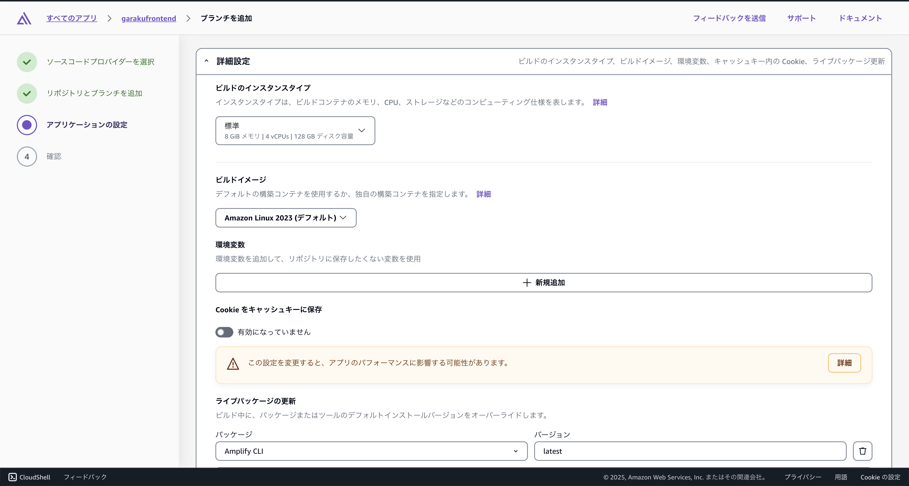
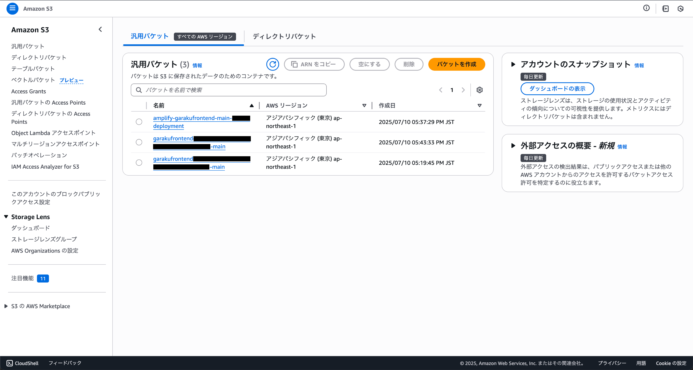
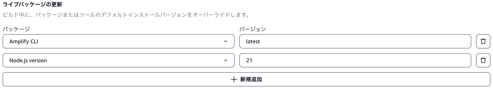

#  ビルドの詳細設定

画面下部にある「詳細設定」をクリックし、ビルド設定を行います



## 環境変数の設定

ここでは、環境変数を設定します。以下の変数を追加してください。

| 変数名 | 値 |
| --- | --- |
| `BUCKET_NAME` | S3のバケット名(自動生成されたものを使用) |
| `VITE_OFFICE_MODE` | オフィスモードの設定（`true`または`false`） |
| `VITE_STANDARD_REGISTER_DISABLE` | 標準登録の無効化（`true`または`false`） | 

### BUCKET_NAMEの取得方法

Amplifyのバックエンド環境で作成されたS3バケットの名前を取得するには、AWSコンソールのS3サービスにアクセスし、該当するバケットを選択します。バケット名は、`garakufrontend<ランダムな文字列>-main`の形式になっています。`main`は、選択したブランチ名に応じて変わる可能性があります。



### VITE_OFFICE_MODEの設定(ベータ)

`VITE_OFFICE_MODE`は、オフィスモードの設定です。オフィスモードは、オフィスに設置したパソコンからのアクセスを想定したモードで、特定の機能や表示が有効になります。オフィスモードを有効にする場合は`true`、無効にする場合は`false`を設定します。

## ライブパッケージの更新

ライブパッケージにビルドで使用するNode.jsのバージョンを指定します。画像では`21`が指定されていますが、`amplify.yml`ファイルで指定したバージョンと一致させる必要がありますので、初めて環境構築する場合は、最新のバージョンを確認してから指定してください。



```yaml title="./amplify.yml"
frontend:
  phases:
    preBuild:
      commands:
        // highlight-start
        - nvm use 22
        // highlight-end
        - npm install -g ulid
        - REVISION_ID=`ulid`
        - npm ci
    build:
```
