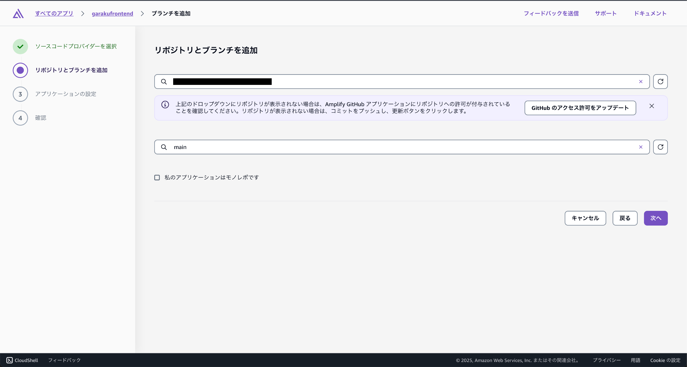

# リポジトリとブランチの選択

GitHubアカウントにログインし、リポジトリとブランチを選択します。ここでは、`cloud-kinmu-frontend`リポジトリの`main`ブランチを選択します。

:::warning[リポジトリが表示されない場合]
リポジトリが表示されない場合は、GitHubの設定でAmplifyにアクセス権を付与する必要があります。GitHubの設定から、アプリケーションのアクセス権を確認し、Amplifyに必要な権限を付与してください。
:::
