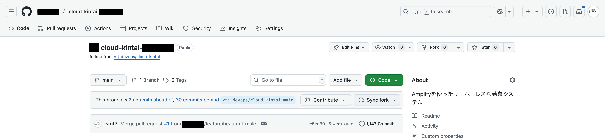

# バージョンアップ

開発元のリポジトリに新しいバージョンがリリースされた場合、以下の手順でクラウド勤怠を最新の状態に更新できます。

新しいバージョンのリリースには、バグ修正や機能追加が含まれています。更新を行うことで、最新の機能を利用できるようになります。

リリースには、セキュリティの修正やパフォーマンスの向上も含まれることがありますので、定期的に更新を行うことをお勧めします。

## フォーク元から変更を取り込む

はじめに、WebブラウザでGitHubのリポジトリにアクセスします。

次に、画面上部の「Code」ボタン近くにある「Sync fork」ボタンをクリックします。

import Img016 from '@site/static/img/docs/001.png';

これにより、フォーク元のリポジトリから最新の変更を取り込みます。

:::warning[エラーが発生した場合]
もし「Sync fork」ボタンが表示されない場合や、エラーが発生した場合は、サポート窓口にお問い合わせください。
:::
