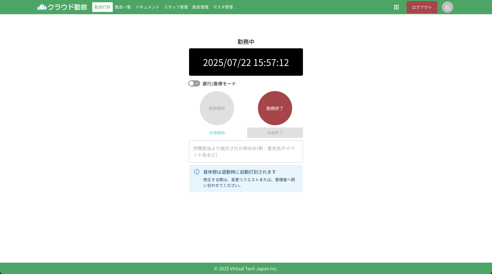

# はじめに

## クラウド勤怠とは

社内向けの勤怠システムとして開発された、オープンソースの勤怠管理システムです。このシステムは、従業員の出勤・退勤時間、休暇などの記録を管理し、リアルタイムでの勤怠情報の確認が可能です。

## クラウド勤怠を始めるには

管理者から招待を受ける必要があります。招待を受けると、アカウントが作成され、招待メールが送信されます。メールに記載されたリンクをクリックして、アカウントの設定を完了してください。

:::info[システムの構築方法]

クラウド勤怠は、AWS Amplifyを使用して構築されています。システムの詳細な構築方法については、開発者向けのチュートリアルを参照してください。
:::
