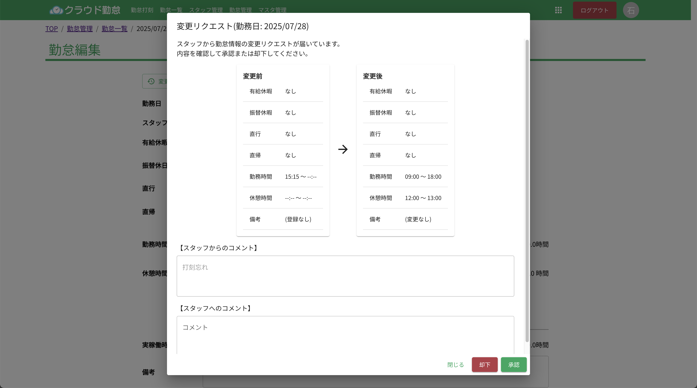

# 勤怠変更リクエスト

スタッフからの勤怠変更リクエストを管理する方法を説明します。勤怠変更リクエストは、スタッフが自分の勤怠情報を修正したい場合に使用されます。

スタッフから勤怠のリクエストが送信されると、管理者宛にメールが送信されます。管理者は、リクエストを承認または却下することができます。

メールに記載されているリンクをクリックすると、リクエストの詳細を確認できます。リクエストの内容を確認し、必要に応じてコメントを追加することができます。

## リクエストの承認または却下

リクエストの詳細ページで、以下の操作が可能です。

- **承認**: リクエストを承認すると、スタッフの勤怠情報が更新され、承認の通知がスタッフに送信される
- **却下**: リクエストを却下すると、スタッフに却下の通知が送信される

