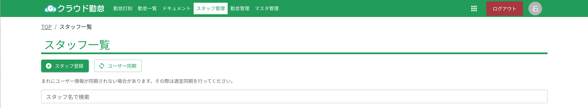

# スタッフ追加

:::warning[注意]
このページはスタッフ管理者向けのマニュアルです。操作には、スタッフ管理者権限が必要です。
:::

クラウド勤怠に新しいスタッフを追加する方法を説明します。スタッフを追加することで、チームメンバーがクラウド勤怠の機能を利用できるようになります。

## 事前準備

スタッフを追加する前に、以下の情報を確認してください。

- **名前(姓名)**: スタッフの名前を用意します。
- **メールアドレス**: スタッフが使用するメールアドレスを用意します。
- **権限**: スタッフに付与する権限を決めます。

### 権限

クラウド勤怠では、スタッフに以下の権限を設定できます。

| 権限 | 説明 |
| --- | --- |
| スタッフ | スタッフとしての基本的な権限 |
| 管理者 | スタッフの管理や設定変更が可能 |
| オペレーター | オフィスモードの時に使用できます |

## 手順

スタッフ管理画面にアクセスし、「スタッフ登録」ボタンをクリックします。

入力フォームが表示されたら必要な情報入力し、登録ボタンをクリックします。

登録が完了すると、スタッフにメールが送信されます。スタッフ側の詳しい手順は、スタッフ向けマニュアルを参照してください。
