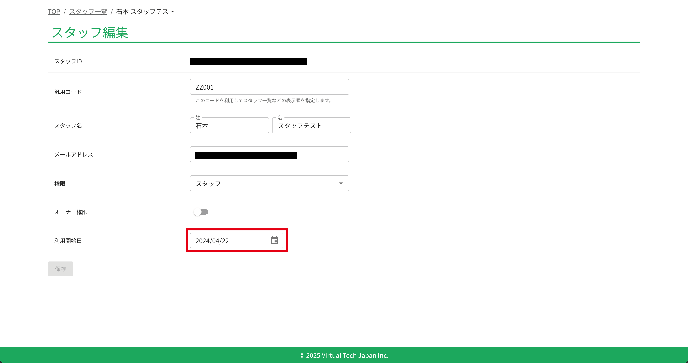

# 利用開始日

クラウド勤怠では、当日から過去30日までの範囲で、勤怠のチェックが行われます。しかし、初めてクラウド勤怠を利用する場合は、過去日付のチェックでエラーが発生することがあります。これを回避するために、利用開始日を設定する必要があります。

## 利用開始日の設定方法

クラウド勤怠にログインし、管理者メニューから「スタッフ管理」を選択します。スタッフの一覧が表示されたら、利用開始日を設定したスタッフの編集アイコンをクリックします。

スタッフ情報の編集画面が表示されたら、利用開始日に設定したい日付を選択します。この日付は、スタッフがクラウド勤怠を利用し始める日となります。設定が完了したら、保存ボタンをクリックして変更を保存します。

