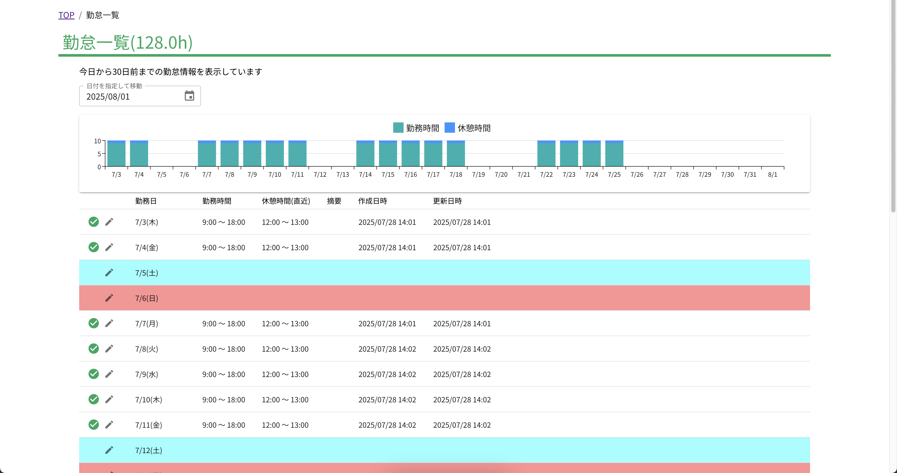
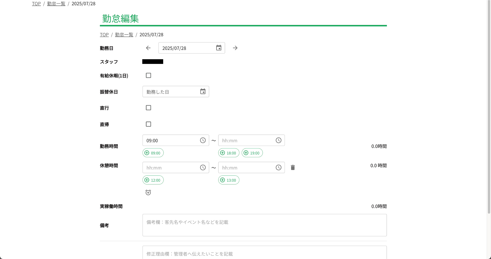
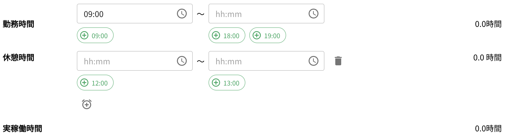

# 変更申請

勤怠情報の変更が必要な場合は、変更申請を行うことができます。申請は、勤怠一覧画面から行います。申請した内容は、管理者が確認し、承認または却下されます。

変更した内容は、承認されるまでは反映されません。承認後、勤怠情報が更新されます。

## 変更申請の手順

クラウド勤怠にログインし、勤怠一覧画面にアクセスします。変更したい日付の鉛筆アイコンをクリックします。

次に、変更したい項目を入力します。必要な項目を入力し、「変更申請」ボタンをクリックします。

よくある変更内容をまとめています。申請の際の参考にしてください。

### 出勤時間を変更する場合(打刻を忘れた場合など)

出勤時間を変更する場合は、出勤時間の欄に新しい時刻を入力します。例えば、8:30から9:00に変更したい場合は、9:00と入力します。

### 退勤時間を変更する場合(打刻を忘れた場合など)

退勤時間を変更する場合は、退勤時間の欄に新しい時刻を入力します。例えば、17:30から18:00に変更したい場合は、18:00と入力します。

退勤打刻を忘れて申請する場合は、退勤時間の欄に新しい時刻を入力します。また、合わせて休憩時間の欄も入力する必要があります。

昼休憩は所属企業・団体によって異なりますが、一般的には1時間です。例えば、12:00から13:00までの休憩を取った場合は、休憩時間の欄に1時間と入力します。
