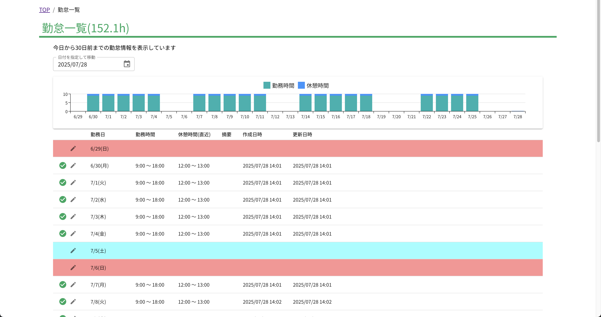

# 勤怠一覧

30日分の勤怠情報を一覧で確認できます。各日付の編集アイコンをクリックすると、指定した日の勤怠情報を編集できます。

## グラフ

30日分の勤務時間と休憩時間のグラフを表示します。

## 一覧

| 項目名 | 内容 |
| --- | --- |
| ステータス | 打刻忘れなど勤怠上の問題がある場合は、エラーが表示される |
| 編集アイコン | 指定した日の勤怠情報を編集できる |
| 勤務日 | 勤務した日付 |
| 勤務開始 | 勤務を開始した時刻 |
| 勤務終了 | 勤務を終了した時刻 |
| 休憩時間 | 休憩をした開始時刻と終了時刻 |
| 摘要 | 打刻画面で記録した備考などの情報 |
| 作成日時 | 勤怠レコードが作成された日時(システム用) |
| 更新日時 | 勤怠レコードが更新された日時(システム用) |
