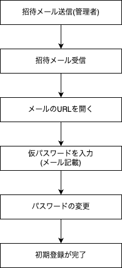
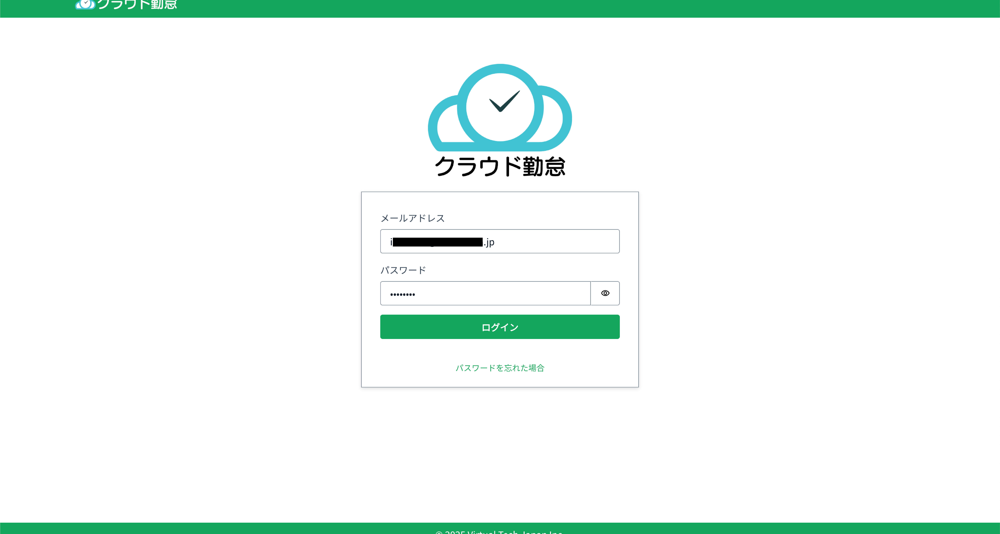
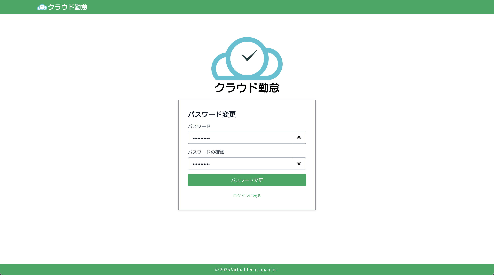

# ログイン方法

これからクラウド勤怠にログインする方法を説明します。初めて利用する方は、管理者からの招待メールを受け取った後、以下の手順に従ってください。



## 招待メール受信

管理者からの招待を受けた後、招待メールに記載されたリンクをクリックして、クラウド勤怠のログインページにアクセスします。

### 招待メールの例

**タイトル**

```
【クラウド勤怠】仮パスワード発行のお知らせ
```

**本文**

```
クラウド勤怠に招待されました。

https://example.com/

上記のURLにアクセスし、以下のユーザーID、仮パスワードでログインしてください。

ユーザー名：{username}
仮パスワード：{####}

仮パスワードでログイン後、ご自身で使用するパスワードへ変更が必要です。
また、登録したパスワードは絶対に他人へ教えないでください。
```

`https://example.com/`の部分は、所属企業・団体ごとに異なるため、実際のURLを確認してください。

### ログイン画面表示

メールアドレスとメール本文に記載された`仮パスワード`を入力し、ログインボタンをクリックします。



## パスワードの変更

初めてログインする際は、仮パスワードを使用してログイン後、パスワードの変更が求められます。新しいパスワードを入力し、確認のために再度入力します。



## ログイン完了

パスワードの変更が完了すると、クラウド勤怠の管理者画面にログインできます。
