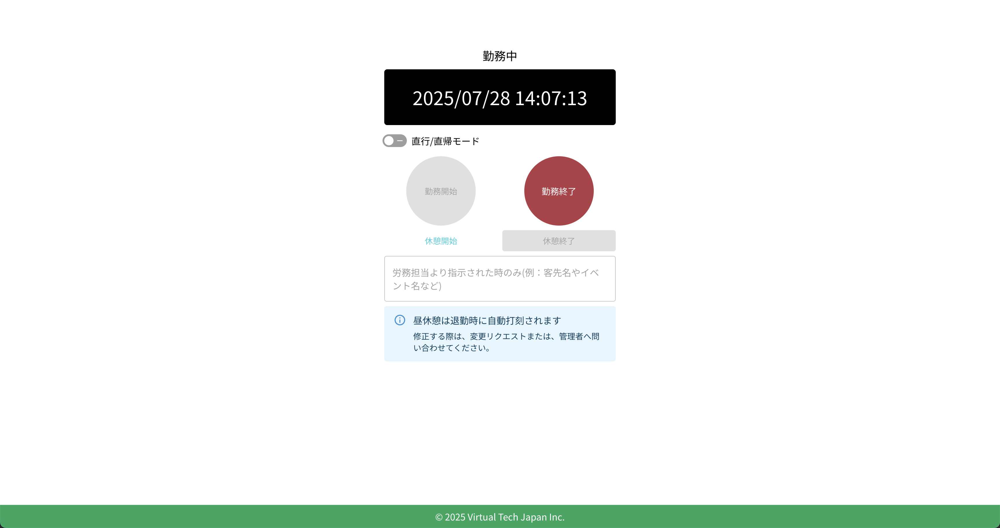

# 休憩終了

休憩を終了するには、クラウド勤怠のTOPページにアクセスします。ログイン後、打刻画面が表示されます。

:::warning[昼休みの打刻について]
昼休みの時間帯は退勤時に自動で打刻されます。所定の昼休憩の時間帯を変更する場合は、勤怠の変更申請を行うか、勤怠管理者へ連絡してください。

また、所定の昼休憩以外の休憩は、手動で打刻する必要があります。
:::

## 休憩終了の打刻

通常休憩の場合は、「休憩終了」ボタンをクリックすると、休憩が終了されます。休憩終了時刻が自動的に記録されます。

## 休憩終了後の確認

休憩終了の打刻が完了すると、「休憩終了」ボタンが無効化され、ステータスが「勤務中」に変わります。

