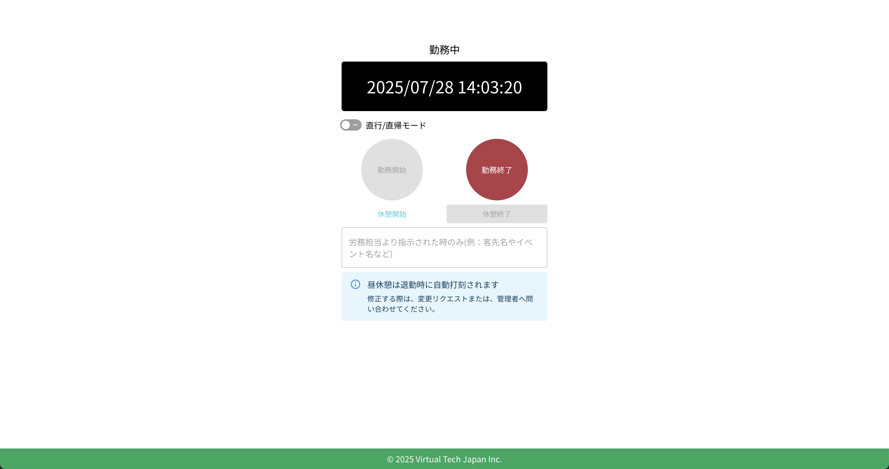
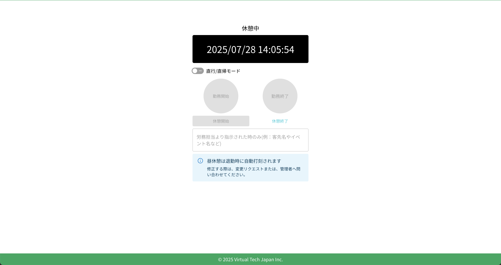

# 休憩開始

休憩を開始するには、クラウド勤怠のTOPページにアクセスします。ログイン後、打刻画面が表示されます。

:::warning[昼休みの打刻について]
昼休みの時間帯は退勤時に自動で打刻されます。所定の昼休憩の時間帯を変更する場合は、勤怠の変更申請を行うか、勤怠管理者へ連絡してください。

また、所定の昼休憩以外の休憩は、手動で打刻する必要があります。
:::

## 休憩開始の打刻

通常休憩の場合は、「休憩開始」ボタンをクリックすると、休憩が開始されます。休憩開始時刻が自動的に記録されます。

## 休憩開始後の確認

休憩開始の打刻が完了すると、「休憩開始」ボタンが無効化され、ステータスが「休憩中」に変わります。

