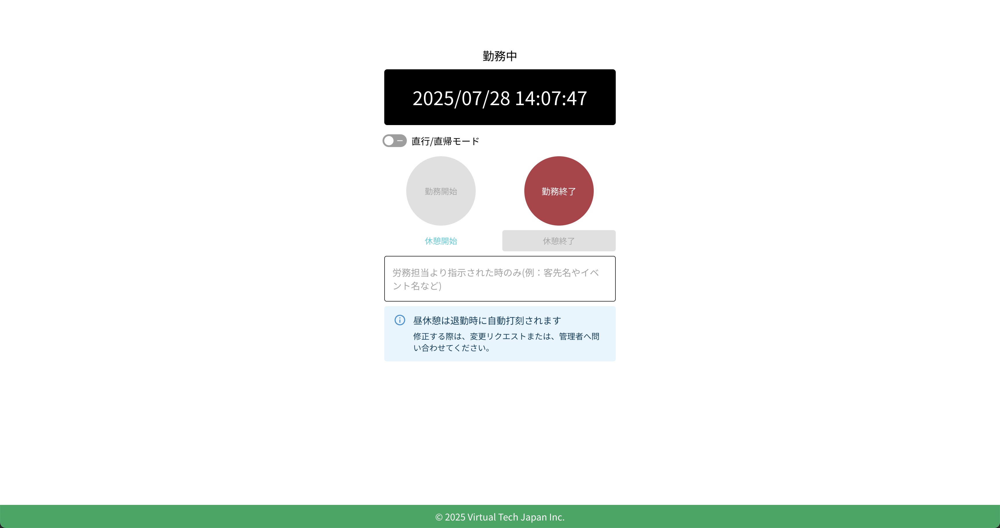
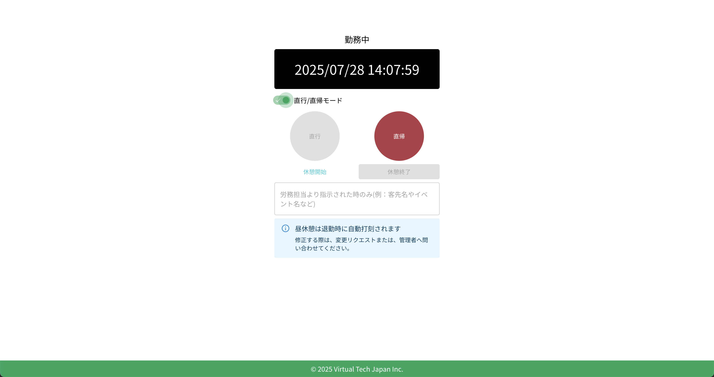
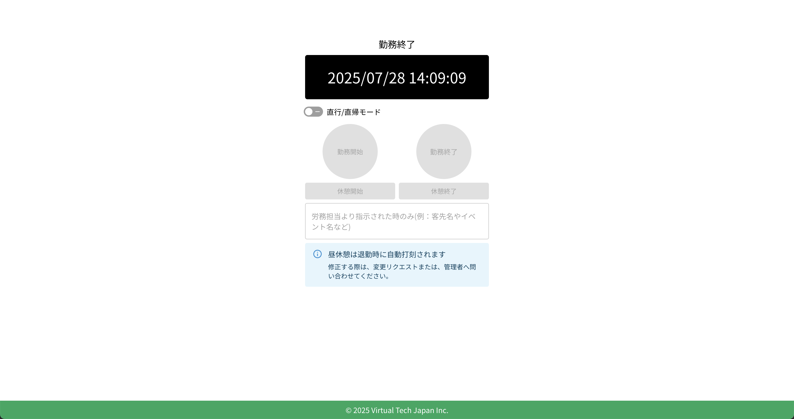

# 勤務終了

勤務を終了するには、クラウド勤怠のTOPページにアクセスします。ログイン後、打刻画面が表示されます。

:::warning[昼休みの打刻について]
退勤時に昼休みの時間帯が自動で打刻されます。所定の昼休憩の時間帯を変更する場合は、勤怠の変更申請を行うか、勤怠管理者へ連絡してください。

また、所定の昼休憩以外の休憩は、手動で打刻する必要があります。
:::

## 通常退勤の場合

通常退勤の場合は、「勤務終了」ボタンをクリックすると、勤務が終了されます。勤務終了時刻が自動的に記録されます。

## 直帰の場合

直帰の場合は、「直行/直帰モード」をオンにしてから、「直帰」ボタンをクリックします。これにより、直帰の勤務が終了されます。

:::warning[注意]
直帰で打刻すると、既定の勤務終了時刻で打刻されます
。直帰の勤務終了時刻を変更する場合は、勤怠の変更申請を行うか、勤怠管理者へ連絡してください。
:::

## 勤務終了の確認

勤務終了の打刻が完了すると、「勤務終了」ボタンが無効化され、ステータスが「勤務終了」に変わります。

