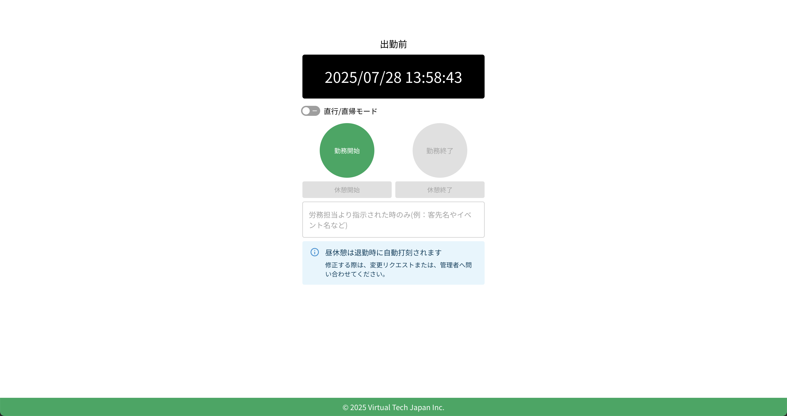
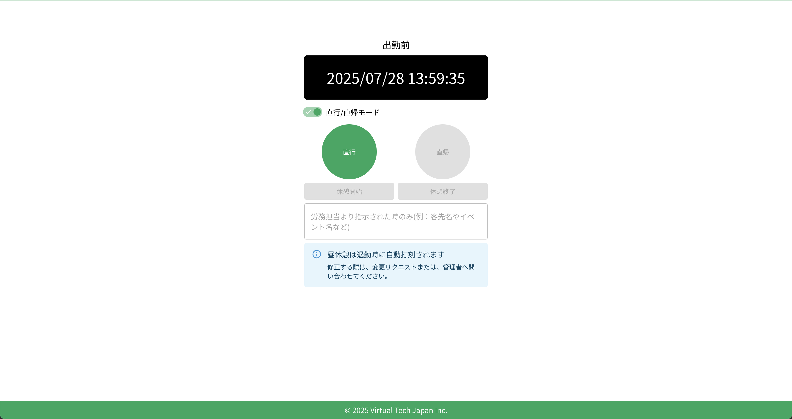

# 勤務開始

勤務を開始するには、クラウド勤怠のTOPページにアクセスします。ログイン後、打刻画面が表示されます。

## 通常出勤の場合

通常出勤の場合は、「勤務開始」ボタンをクリックすると、勤務が開始されます。勤務開始時刻が自動的に記録されます。

## 直行の場合

直行の場合は、「直行/直帰モード」をオンにしてから、「直行」ボタンをクリックします。これにより、直行の勤務が開始されます。

:::warning[注意]
直行で打刻すると、既定の勤務開始時刻で打刻されます。直行の勤務開始時刻を変更する場合は、勤怠の変更申請を行うか、勤怠管理者へ連絡してください。
:::

## 勤務開始の確認

勤務開始の打刻が完了すると、「勤務開始」ボタンが無効化され、ステータスが「勤務中」に変わります。

